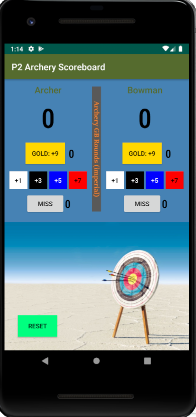

# ArcheryScoreboard

A simple app that keeps score, along with 2 other metrics count, for one archery shooting session.
The code contained by this repo represents my second project for Android Basics NanoDegree at Udacity.

